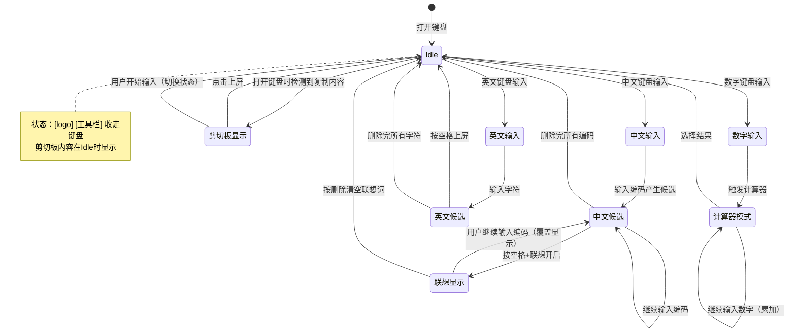
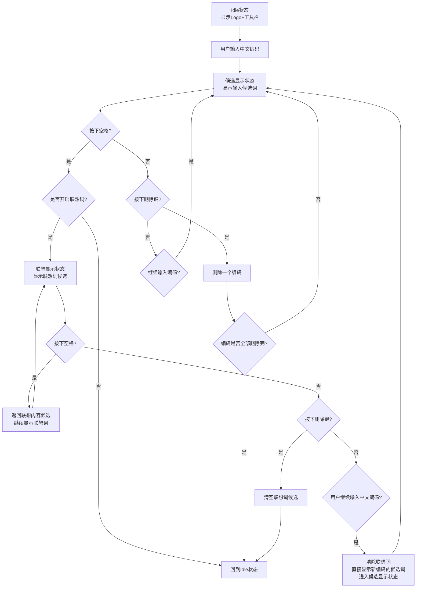
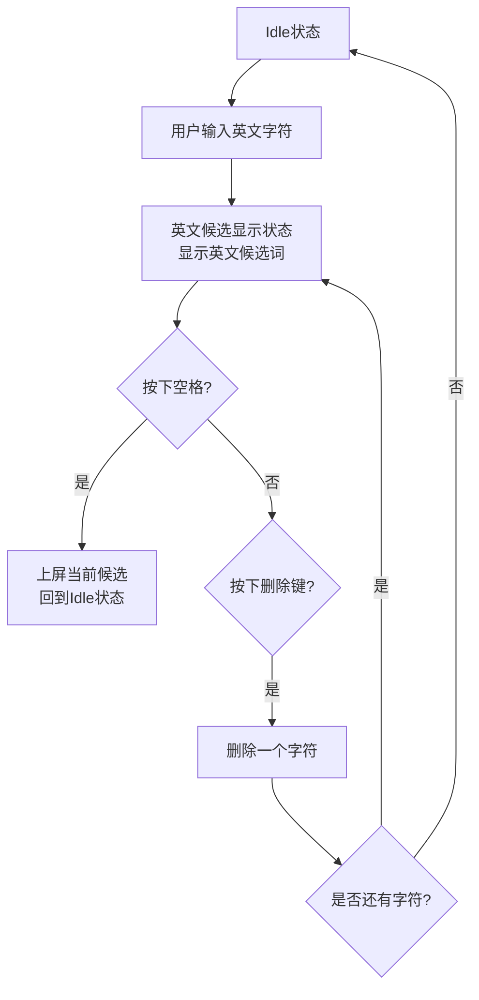
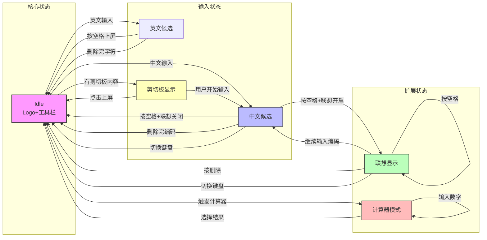

## 完整状态机概览



---

## 1. 中文键盘候选栏流程



**关键规则**
| 场景 | 行为 |
|------|------|
| 中文输入状态下切换键盘 | ✅ 清除编码，回到 Idle |
| 联想状态下继续输入中文 | ✅ 清除联想词，新编码候选直接覆盖显示 |
| 联想状态下按删除 | ✅ 清空联想词，回到 Idle |
| 联想状态下按空格 | ✅ 连续返回联想内容 |

---

## 2. 英文键盘候选栏流程



---

## 3. 数字键盘 + 计算器模式流程

```mermaid
flowchart TD
    A[Idle状态<br/>数字键盘] --> B[用户触发计算器模式]
    B --> C[计算器模式<br/>显示计算公式和当前结果]
    C --> D{用户操作}
    D -->|输入数字| E[继续输入数字<br/>追加到公式中<br/>实时更新结果]
    E --> C
    
    D -->|选择结果| F[将最终结果上屏<br/>回到Idle状态]
    
    D -->|退出计算器| A
    
    note right of E
        已上屏的内容不再修改
        只追加新输入的数字
    end note
```

**关键规则：**
- ✅ 计算器模式下可继续输入数字（追加）
- ✅ 已上屏的内容不再修改
- ✅ 选择结果后回到 Idle

---

## 4. 剪切板显示流程

```mermaid
flowchart TD
    A[用户复制内容] --> B[内容存入剪切板]
    B --> C[打开键盘]
    C --> D{当前是否有输入候选存在?}
    D -->|是| E[不显示剪切板内容<br/>优先显示输入候选]
    D -->|否| F[检测到剪切板有内容<br/>剪切板内容直接显示在候选栏]
    
    F --> G{用户操作}
    G -->|点击复制内容| H[内容上屏<br/>回到Idle状态]
    G -->|用户开始输入| I[隐藏剪切板内容<br/>切换到输入候选状态<br/>进入中文/英文输入流程]
    
    note right of F
        剪切板内容和输入候选
        不会同时存在
    end note
```

**关键规则：**
- ✅ 剪切板内容和输入候选**不会同时存在**
- ✅ 有输入候选时 → 不显示剪切板内容
- ✅ 用户开始输入 → 切换到输入候选状态

---

## 完整状态转换表

| 当前状态 | 触发事件 | 条件/动作 | 下一状态 | 说明 |
|---------|---------|----------|---------|------|
| **Idle** | 中文输入 | - | 中文候选 | 显示输入候选词 |
| **Idle** | 英文输入 | - | 英文候选 | 显示英文候选 |
| **Idle** | 触发计算器 | 数字键盘 | 计算器模式 | 显示公式+结果 |
| **Idle** | 打开键盘 | 剪切板有内容 + 无输入候选 | 剪切板显示 | 直接显示复制内容 |
| **中文候选** | 按空格 | 联想关闭 | Idle | 上屏后回Idle |
| **中文候选** | 按空格 | 联想开启 | 联想显示 | 进入联想状态 |
| **中文候选** | 删除键 | 编码删完 | Idle | 清空编码 |
| **中文候选** | 切换键盘 | - | Idle | ✅ 清除编码回Idle |
| **联想显示** | 按空格 | - | 联想显示 | 连续显示联想词 |
| **联想显示** | 删除键 | - | Idle | 清空联想词 |
| **联想显示** | 继续输入中文 | - | 中文候选 | ✅ 清除联想，覆盖显示新候选 |
| **联想显示** | 切换键盘 | - | Idle | ✅ 清除联想回Idle |
| **英文候选** | 按空格 | - | Idle | 上屏后回Idle |
| **英文候选** | 删除键 | 字符删完 | Idle | 清空字符 |
| **计算器模式** | 输入数字 | - | 计算器模式 | ✅ 追加数字，更新结果 |
| **计算器模式** | 选择结果 | - | Idle | 结果上屏 |
| **剪切板显示** | 点击上屏 | - | Idle | 内容上屏 |
| **剪切板显示** | 用户开始输入 | - | 中文/英文候选 | ✅ 隐藏剪切板，切换到输入 |

---

## 整体状态流转总图



---

## 优先级规则总结

| 优先级 | 显示内容 | 触发条件 |
|-------|---------|---------|
| 1（最高） | 输入候选词 | 用户正在输入中文/英文 |
| 2 | 剪切板内容 | 无输入候选 + 剪切板有内容 |
| 3（最低） | Logo + 工具栏 | 无输入候选 + 无剪切板内容 |

